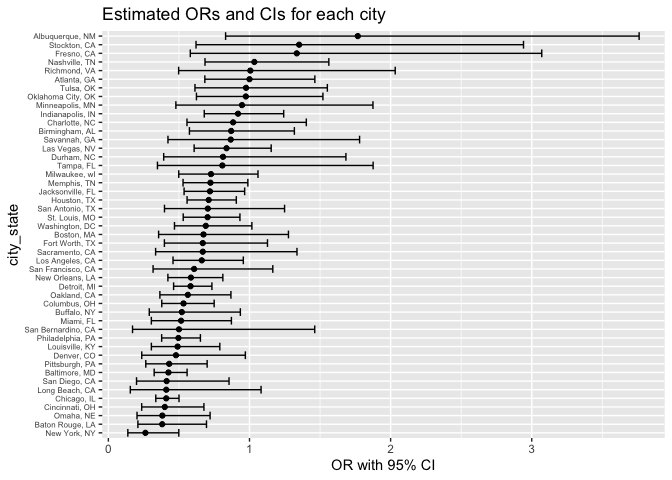

p8105_hw6_qh2284
================
Qin Huang
2023-11-17

## Problem 1

``` r
# load the dataset
homi = read_csv("./dataset/homicide-data.csv")
```

    ## Rows: 52179 Columns: 12
    ## ── Column specification ────────────────────────────────────────────────────────
    ## Delimiter: ","
    ## chr (9): uid, victim_last, victim_first, victim_race, victim_age, victim_sex...
    ## dbl (3): reported_date, lat, lon
    ## 
    ## ℹ Use `spec()` to retrieve the full column specification for this data.
    ## ℹ Specify the column types or set `show_col_types = FALSE` to quiet this message.

**Create a `city_state` variable (e.g. "Baltimore, MD"), and a binary
variable indicating whether the homicide is solved. Omit cities Dallas,
TX; Phoenix, AZ; and Kansas City, MO – these don't report victim race.
Also omit Tulsa, AL – this is a data entry mistake. For this problem,
limit your analysis those for whom `victim_race` is `white` or `black`.
Be sure that `victim_age` is numeric.**

``` r
homi <- homi %>% 
  mutate(city_state = paste0(city,", ",state),
    solved = ifelse(disposition == "Closed by arrest",1,0)) %>% 
  filter(!city_state %in% c("Dallas, TX", "Phoenix, AZ", "Kansas City, MO", "Tulsa, AL")) %>%
  filter(victim_race == "White" | victim_race == "Black") %>% 
  mutate(victim_age = as.numeric(victim_age))
```

    ## Warning: There was 1 warning in `mutate()`.
    ## ℹ In argument: `victim_age = as.numeric(victim_age)`.
    ## Caused by warning:
    ## ! NAs introduced by coercion

**For the city of Baltimore, MD, use the `glm` function to fit a
logistic regression with resolved vs unresolved as the outcome and
victim age, sex and race as predictors. Save the output of `glm` as an R
object; apply the `broom::tidy` to this object; and obtain the estimate
and confidence interval of the adjusted odds ratio for solving homicides
comparing male victims to female victims keeping all other variables
fixed.**

``` r
balt = homi %>% 
  filter(city == "Baltimore") %>% 
  select(solved, victim_age, victim_race, victim_sex) %>%
  mutate(victim_sex = fct_relevel(victim_sex, "Female"))
```

``` r
balt_model = balt %>% 
  glm(solved ~ victim_age + victim_race + victim_sex, data = ., family = binomial())
```

``` r
# save R object
save(balt_model, file = "./result/Baltimore_logistic_model.RData")
```

``` r
balt_model %>% 
  broom::tidy() %>% 
  knitr::kable(digits = 3)
```

| term             | estimate | std.error | statistic | p.value |
|:-----------------|---------:|----------:|----------:|--------:|
| (Intercept)      |    0.310 |     0.171 |     1.810 |   0.070 |
| victim_age       |   -0.007 |     0.003 |    -2.024 |   0.043 |
| victim_raceWhite |    0.842 |     0.175 |     4.818 |   0.000 |
| victim_sexMale   |   -0.854 |     0.138 |    -6.184 |   0.000 |

``` r
odd_ci_balt = balt_model %>% 
  broom::tidy() %>%
  filter(term == 'victim_sexMale') %>% 
  summarise(estimate = estimate,
            OR = exp(estimate),
         OR_lower = exp(estimate - 1.96 * std.error),
         OR_upper = exp(estimate + 1.96 * std.error) ) %>%
  knitr::kable(digits = 3)

odd_ci_balt
```

| estimate |    OR | OR_lower | OR_upper |
|---------:|------:|---------:|---------:|
|   -0.854 | 0.426 |    0.325 |    0.558 |

**Now run `glm` for each of the cities in your dataset, and extract the
adjusted odds ratio (and CI) for solving homicides comparing male
victims to female victims. Do this within a "tidy" pipeline, making use
of `purrr::map`, list columns, and `unnest` as necessary to create a
dataframe with estimated ORs and CIs for each city.**

``` r
# create a function
all_model = function(citystate){
  city_glm = homi %>% 
    filter(city_state == citystate) %>% 
    glm(solved ~ victim_sex + victim_race + victim_age, family = binomial, data = .) %>% 
    broom::tidy() %>% 
    filter(term == "victim_sexMale") %>% 
    summarise(
         estimate = estimate,
         OR = exp(estimate), 
         OR_lower = exp(estimate - 1.96*std.error), 
         OR_upper = exp(estimate + 1.96*std.error))
    
    city_glm
}
```

``` r
glm_all = homi %>%
  dplyr::select(city_state) %>%
  unique() %>%
  mutate(glm = map(city_state, all_model)) %>% 
  unnest(glm) %>% 
  arrange(desc(OR))

glm_all %>%
  knitr::kable(digits = 3)
```

| city_state         | estimate |    OR | OR_lower | OR_upper |
|:-------------------|---------:|------:|---------:|---------:|
| Albuquerque, NM    |    0.570 | 1.767 |    0.831 |    3.761 |
| Stockton, CA       |    0.301 | 1.352 |    0.621 |    2.942 |
| Fresno, CA         |    0.289 | 1.335 |    0.580 |    3.071 |
| Nashville, TN      |    0.034 | 1.034 |    0.685 |    1.562 |
| Richmond, VA       |    0.006 | 1.006 |    0.498 |    2.033 |
| Atlanta, GA        |    0.000 | 1.000 |    0.684 |    1.463 |
| Tulsa, OK          |   -0.025 | 0.976 |    0.614 |    1.552 |
| Oklahoma City, OK  |   -0.026 | 0.974 |    0.624 |    1.520 |
| Minneapolis, MN    |   -0.054 | 0.947 |    0.478 |    1.875 |
| Indianapolis, IN   |   -0.085 | 0.919 |    0.679 |    1.242 |
| Charlotte, NC      |   -0.123 | 0.884 |    0.557 |    1.403 |
| Birmingham, AL     |   -0.139 | 0.870 |    0.574 |    1.318 |
| Savannah, GA       |   -0.143 | 0.867 |    0.422 |    1.780 |
| Las Vegas, NV      |   -0.178 | 0.837 |    0.608 |    1.154 |
| Durham, NC         |   -0.208 | 0.812 |    0.392 |    1.683 |
| Tampa, FL          |   -0.214 | 0.808 |    0.348 |    1.876 |
| Milwaukee, wI      |   -0.319 | 0.727 |    0.499 |    1.060 |
| Memphis, TN        |   -0.324 | 0.723 |    0.529 |    0.988 |
| Jacksonville, FL   |   -0.329 | 0.720 |    0.537 |    0.966 |
| Houston, TX        |   -0.341 | 0.711 |    0.558 |    0.907 |
| San Antonio, TX    |   -0.350 | 0.705 |    0.398 |    1.249 |
| St. Louis, MO      |   -0.352 | 0.703 |    0.530 |    0.932 |
| Washington, DC     |   -0.371 | 0.690 |    0.468 |    1.017 |
| Boston, MA         |   -0.395 | 0.674 |    0.356 |    1.276 |
| Fort Worth, TX     |   -0.402 | 0.669 |    0.397 |    1.127 |
| Sacramento, CA     |   -0.402 | 0.669 |    0.335 |    1.337 |
| Los Angeles, CA    |   -0.413 | 0.662 |    0.458 |    0.956 |
| San Francisco, CA  |   -0.498 | 0.608 |    0.317 |    1.165 |
| New Orleans, LA    |   -0.536 | 0.585 |    0.422 |    0.811 |
| Detroit, MI        |   -0.541 | 0.582 |    0.462 |    0.734 |
| Oakland, CA        |   -0.574 | 0.563 |    0.365 |    0.868 |
| Columbus, OH       |   -0.630 | 0.532 |    0.378 |    0.750 |
| Buffalo, NY        |   -0.653 | 0.521 |    0.290 |    0.935 |
| Miami, FL          |   -0.663 | 0.515 |    0.304 |    0.872 |
| San Bernardino, CA |   -0.692 | 0.500 |    0.171 |    1.462 |
| Philadelphia, PA   |   -0.701 | 0.496 |    0.378 |    0.652 |
| Louisville, KY     |   -0.712 | 0.491 |    0.305 |    0.790 |
| Denver, CO         |   -0.736 | 0.479 |    0.236 |    0.971 |
| Pittsburgh, PA     |   -0.842 | 0.431 |    0.265 |    0.700 |
| Baltimore, MD      |   -0.854 | 0.426 |    0.325 |    0.558 |
| San Diego, CA      |   -0.884 | 0.413 |    0.200 |    0.855 |
| Long Beach, CA     |   -0.891 | 0.410 |    0.156 |    1.082 |
| Chicago, IL        |   -0.891 | 0.410 |    0.336 |    0.501 |
| Cincinnati, OH     |   -0.917 | 0.400 |    0.236 |    0.677 |
| Omaha, NE          |   -0.961 | 0.382 |    0.203 |    0.721 |
| Baton Rouge, LA    |   -0.964 | 0.381 |    0.209 |    0.695 |
| New York, NY       |   -1.338 | 0.262 |    0.138 |    0.499 |

**Create a plot that shows the estimated ORs and CIs for each city.
Organize cities according to estimated OR, and comment on the plot.**

``` r
ggplot(glm_all, aes(x=OR, y = fct_reorder(city_state, OR))) +
  geom_point() +
  geom_errorbar(aes(xmin = OR_lower, xmax = OR_upper)) +
  labs(x = 'OR with 95% CI', y = 'city_state', title = 'Estimated ORs and CIs for each city') +
  theme(axis.text.y = element_text(hjust = 1,size = 6))
```

<!-- -->
