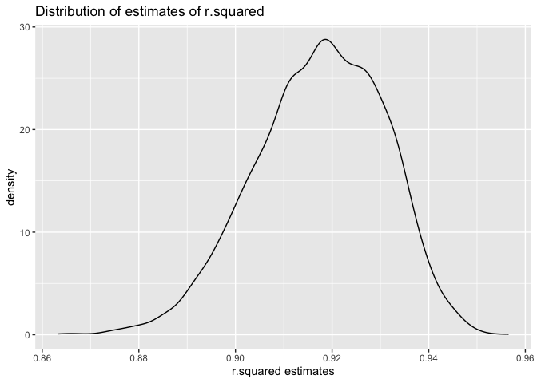
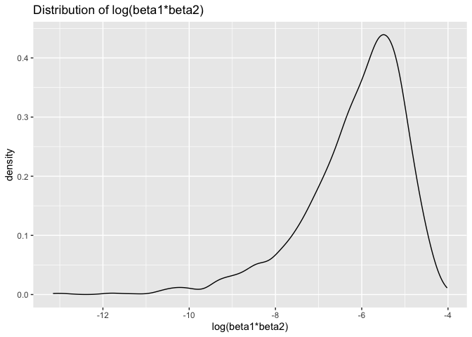
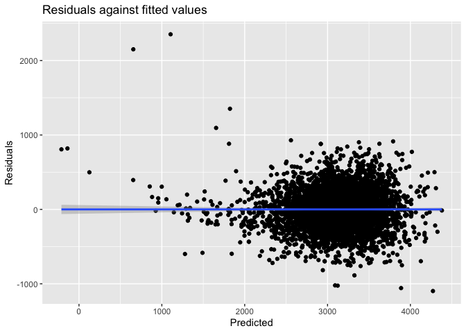
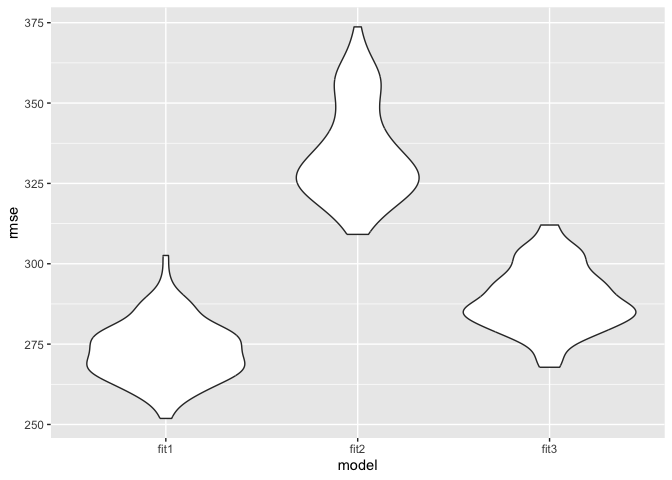

p8105_hw6_qh2284
================
Qin Huang
2023-11-17

## Problem 1

``` r
# load the dataset
homi = read_csv("./dataset/homicide-data.csv")
```

    ## Rows: 52179 Columns: 12
    ## ── Column specification ────────────────────────────────────────────────────────
    ## Delimiter: ","
    ## chr (9): uid, victim_last, victim_first, victim_race, victim_age, victim_sex...
    ## dbl (3): reported_date, lat, lon
    ## 
    ## ℹ Use `spec()` to retrieve the full column specification for this data.
    ## ℹ Specify the column types or set `show_col_types = FALSE` to quiet this message.

**Create a `city_state` variable (e.g. “Baltimore, MD”), and a binary
variable indicating whether the homicide is solved. Omit cities Dallas,
TX; Phoenix, AZ; and Kansas City, MO – these don’t report victim race.
Also omit Tulsa, AL – this is a data entry mistake. For this problem,
limit your analysis those for whom `victim_race` is `white` or `black`.
Be sure that `victim_age` is numeric.**

``` r
homi <- homi %>% 
  mutate(city_state = paste0(city,", ",state),
    solved = ifelse(disposition == "Closed by arrest",1,0)) %>% 
  filter(!city_state %in% c("Dallas, TX", "Phoenix, AZ", "Kansas City, MO", "Tulsa, AL")) %>%
  filter(victim_race == "White" | victim_race == "Black") %>% 
  mutate(victim_age = as.numeric(victim_age))
```

**For the city of Baltimore, MD, use the `glm` function to fit a
logistic regression with resolved vs unresolved as the outcome and
victim age, sex and race as predictors. Save the output of `glm` as an R
object; apply the `broom::tidy` to this object; and obtain the estimate
and confidence interval of the adjusted odds ratio for solving homicides
comparing male victims to female victims keeping all other variables
fixed.**

``` r
balt = homi %>% 
  filter(city == "Baltimore") %>% 
  dplyr::select(solved, victim_age, victim_race, victim_sex) %>%
  mutate(victim_sex = fct_relevel(victim_sex, "Female"))
```

``` r
balt_model = balt %>% 
  glm(solved ~ victim_age + victim_race + victim_sex, data = ., family = binomial())
```

``` r
# save R object
save(balt_model, file = "./result/Baltimore_logistic_model.RData")
```

``` r
balt_model %>% 
  broom::tidy() %>% 
  knitr::kable(digits = 3)
```

| term             | estimate | std.error | statistic | p.value |
|:-----------------|---------:|----------:|----------:|--------:|
| (Intercept)      |    0.310 |     0.171 |     1.810 |   0.070 |
| victim_age       |   -0.007 |     0.003 |    -2.024 |   0.043 |
| victim_raceWhite |    0.842 |     0.175 |     4.818 |   0.000 |
| victim_sexMale   |   -0.854 |     0.138 |    -6.184 |   0.000 |

``` r
odd_ci_balt = balt_model %>% 
  broom::tidy() %>%
  filter(term == 'victim_sexMale') %>% 
  summarise(estimate = estimate,
            OR = exp(estimate),
         OR_lower = exp(estimate - 1.96 * std.error),
         OR_upper = exp(estimate + 1.96 * std.error) ) %>%
  knitr::kable(digits = 3)

odd_ci_balt
```

| estimate |    OR | OR_lower | OR_upper |
|---------:|------:|---------:|---------:|
|   -0.854 | 0.426 |    0.325 |    0.558 |

**Now run `glm` for each of the cities in your dataset, and extract the
adjusted odds ratio (and CI) for solving homicides comparing male
victims to female victims. Do this within a “tidy” pipeline, making use
of `purrr::map`, list columns, and `unnest` as necessary to create a
dataframe with estimated ORs and CIs for each city.**

``` r
# create a function
all_model = function(citystate){
  city_glm = homi %>% 
    filter(city_state == citystate) %>% 
    glm(solved ~ victim_sex + victim_race + victim_age, family = binomial, data = .) %>% 
    broom::tidy() %>% 
    filter(term == "victim_sexMale") %>% 
    summarise(
         estimate = estimate,
         OR = exp(estimate), 
         OR_lower = exp(estimate - 1.96*std.error), 
         OR_upper = exp(estimate + 1.96*std.error))
    
    city_glm
}
```

``` r
glm_all = homi %>%
  dplyr::select(city_state) %>%
  unique() %>%
  mutate(glm = map(city_state, all_model)) %>% 
  unnest(glm) %>% 
  arrange(desc(OR))

glm_all %>%
  knitr::kable(digits = 3)
```

| city_state         | estimate |    OR | OR_lower | OR_upper |
|:-------------------|---------:|------:|---------:|---------:|
| Albuquerque, NM    |    0.570 | 1.767 |    0.831 |    3.761 |
| Stockton, CA       |    0.301 | 1.352 |    0.621 |    2.942 |
| Fresno, CA         |    0.289 | 1.335 |    0.580 |    3.071 |
| Nashville, TN      |    0.034 | 1.034 |    0.685 |    1.562 |
| Richmond, VA       |    0.006 | 1.006 |    0.498 |    2.033 |
| Atlanta, GA        |    0.000 | 1.000 |    0.684 |    1.463 |
| Tulsa, OK          |   -0.025 | 0.976 |    0.614 |    1.552 |
| Oklahoma City, OK  |   -0.026 | 0.974 |    0.624 |    1.520 |
| Minneapolis, MN    |   -0.054 | 0.947 |    0.478 |    1.875 |
| Indianapolis, IN   |   -0.085 | 0.919 |    0.679 |    1.242 |
| Charlotte, NC      |   -0.123 | 0.884 |    0.557 |    1.403 |
| Birmingham, AL     |   -0.139 | 0.870 |    0.574 |    1.318 |
| Savannah, GA       |   -0.143 | 0.867 |    0.422 |    1.780 |
| Las Vegas, NV      |   -0.178 | 0.837 |    0.608 |    1.154 |
| Durham, NC         |   -0.208 | 0.812 |    0.392 |    1.683 |
| Tampa, FL          |   -0.214 | 0.808 |    0.348 |    1.876 |
| Milwaukee, wI      |   -0.319 | 0.727 |    0.499 |    1.060 |
| Memphis, TN        |   -0.324 | 0.723 |    0.529 |    0.988 |
| Jacksonville, FL   |   -0.329 | 0.720 |    0.537 |    0.966 |
| Houston, TX        |   -0.341 | 0.711 |    0.558 |    0.907 |
| San Antonio, TX    |   -0.350 | 0.705 |    0.398 |    1.249 |
| St. Louis, MO      |   -0.352 | 0.703 |    0.530 |    0.932 |
| Washington, DC     |   -0.371 | 0.690 |    0.468 |    1.017 |
| Boston, MA         |   -0.395 | 0.674 |    0.356 |    1.276 |
| Fort Worth, TX     |   -0.402 | 0.669 |    0.397 |    1.127 |
| Sacramento, CA     |   -0.402 | 0.669 |    0.335 |    1.337 |
| Los Angeles, CA    |   -0.413 | 0.662 |    0.458 |    0.956 |
| San Francisco, CA  |   -0.498 | 0.608 |    0.317 |    1.165 |
| New Orleans, LA    |   -0.536 | 0.585 |    0.422 |    0.811 |
| Detroit, MI        |   -0.541 | 0.582 |    0.462 |    0.734 |
| Oakland, CA        |   -0.574 | 0.563 |    0.365 |    0.868 |
| Columbus, OH       |   -0.630 | 0.532 |    0.378 |    0.750 |
| Buffalo, NY        |   -0.653 | 0.521 |    0.290 |    0.935 |
| Miami, FL          |   -0.663 | 0.515 |    0.304 |    0.872 |
| San Bernardino, CA |   -0.692 | 0.500 |    0.171 |    1.462 |
| Philadelphia, PA   |   -0.701 | 0.496 |    0.378 |    0.652 |
| Louisville, KY     |   -0.712 | 0.491 |    0.305 |    0.790 |
| Denver, CO         |   -0.736 | 0.479 |    0.236 |    0.971 |
| Pittsburgh, PA     |   -0.842 | 0.431 |    0.265 |    0.700 |
| Baltimore, MD      |   -0.854 | 0.426 |    0.325 |    0.558 |
| San Diego, CA      |   -0.884 | 0.413 |    0.200 |    0.855 |
| Long Beach, CA     |   -0.891 | 0.410 |    0.156 |    1.082 |
| Chicago, IL        |   -0.891 | 0.410 |    0.336 |    0.501 |
| Cincinnati, OH     |   -0.917 | 0.400 |    0.236 |    0.677 |
| Omaha, NE          |   -0.961 | 0.382 |    0.203 |    0.721 |
| Baton Rouge, LA    |   -0.964 | 0.381 |    0.209 |    0.695 |
| New York, NY       |   -1.338 | 0.262 |    0.138 |    0.499 |

**Create a plot that shows the estimated ORs and CIs for each city.
Organize cities according to estimated OR, and comment on the plot.**

``` r
ggplot(glm_all, aes(x=OR, y = fct_reorder(city_state, OR))) +
  geom_point() +
  geom_errorbar(aes(xmin = OR_lower, xmax = OR_upper)) +
  labs(x = 'OR with 95% CI', y = 'city_state', title = 'Estimated ORs and CIs for each city') +
  theme(axis.text.y = element_text(hjust = 1,size = 6))
```

<!-- -->

Comment: We could observe New York, NY has the smallest OR and
Albuquerque, NM has the largest OR.

## Problem 2

**The boostrap is helpful when you’d like to perform inference for a
parameter / value / summary that doesn’t have an easy-to-write-down
distribution in the usual repeated sampling framework. We’ll focus on a
simple linear regression with `tmax` as the response with `tmin` and
`prcp` as the predictors, and are interested in the distribution of two
quantities estimated from these data:**

- $\hat{r}^2$

- $log(\hat{\beta_1} * \hat{\beta_2})$

**Use 5000 bootstrap samples and, for each bootstrap sample, produce
estimates of these two quantities. Plot the distribution of your
estimates, and describe these in words. Using the 5000 bootstrap
estimates, identify the 2.5% and 97.5% quantiles to provide a 95%
confidence interval for** $\hat{r}^2$ **and**
$log(\hat{\beta_1} * \hat{\beta_2})$**. Note: `broom::glance()` is
helpful for extracting** $\hat{r}^2$ **from a fitted regression, and
`broom::tidy()` (with some additional wrangling) should help in
computing** $log(\hat{\beta_1} * \hat{\beta_2})$**.**

``` r
# load the dataset
weather_df = 
  rnoaa::meteo_pull_monitors(
    c("USW00094728"),
    var = c("PRCP", "TMIN", "TMAX"), 
    date_min = "2022-01-01",
    date_max = "2022-12-31") |>
  mutate(
    name = recode(id, USW00094728 = "CentralPark_NY"),
    tmin = tmin / 10,
    tmax = tmax / 10) |>
  dplyr::select(name, id, everything())
```

    ## using cached file: /Users/qin/Library/Caches/org.R-project.R/R/rnoaa/noaa_ghcnd/USW00094728.dly

    ## date created (size, mb): 2023-11-18 20:20:09.56685 (8.544)

    ## file min/max dates: 1869-01-01 / 2023-11-30

``` r
boot_strap = weather_df %>% 
  modelr::bootstrap(n = 5000) %>% 
  mutate(
    mods = map(strap, ~lm(tmax ~ tmin + prcp, data = .x)),
    mods_beta = map(mods, broom::glance),
    mods_r2 = map(mods, broom::tidy)) %>% 
  unnest(mods_r2, mods_beta) %>% 
  dplyr::select(.id, term, estimate, r.squared) %>% 
  pivot_wider(names_from = term, values_from = estimate) %>% 
  rename(
    beta_0 = `(Intercept)`,
    beta_1 = tmin,
    beta_2 = prcp) 

res = boot_strap %>%
  summarise(r.squared = r.squared,
    log_beta12 = log(beta_1 * beta_2))

res_noNA = res %>%
  na.omit()

head(res)
```

    ## # A tibble: 6 × 2
    ##   r.squared log_beta12
    ##       <dbl>      <dbl>
    ## 1     0.913      -7.92
    ## 2     0.933     NaN   
    ## 3     0.922     NaN   
    ## 4     0.927     NaN   
    ## 5     0.920     NaN   
    ## 6     0.925     NaN

``` r
# calculate CI for r-squared and log
r2_ci = 
  quantile(pull(res,r.squared), probs = c(0.025,0.975)) %>% 
  knitr::kable()

log_ci = 
  quantile(pull(res_noNA,log_beta12), probs = c(0.025,0.975)) %>% 
  knitr::kable()
  
r2_ci
```

|       |         x |
|:------|----------:|
| 2.5%  | 0.8883467 |
| 97.5% | 0.9407047 |

``` r
log_ci
```

|       |         x |
|:------|----------:|
| 2.5%  | -9.207000 |
| 97.5% | -4.535707 |

``` r
r2_dist = res %>%
  ggplot(aes(x = r.squared)) +
  geom_density() +
  labs(title = "Distribution of estimates of r.squared", x = "r.squared estimates")

r2_dist
```

<!-- -->

Comment: We could observe that values r^2 are all close to 1, which
means there’re strong linear relation and tmin and prcp are good
indicators of tmax. Also, the distribution is approximately as normal
distribution but left-skewed.

``` r
b1b2_dist = res_noNA %>%
  ggplot(aes(x = log_beta12)) +
  geom_density() +
  labs(title = "Distribution of log(beta1*beta2)", x = "log(beta1*beta2)")

b1b2_dist
```

<!-- -->

Comment: The distribution is somewhat skewed and has some outliers.
Large samples are useful for inference to some point.

## Problem 3

**Load and clean the data for regression analysis (i.e. convert numeric
to factor where appropriate, check for missing data, etc.).**

``` r
# load the dataset
birth = read.csv("./dataset/birthweight.csv")
```

``` r
# tidy
birth = birth %>%
  janitor::clean_names() %>% 
  mutate(babysex = case_when(babysex == 1 ~ 'male',
                             babysex == 2 ~ 'female'),
         frace = recode(frace, "1" = "White", "2" = "Black", "3" = "Asian", "4" = "Puerto Rican", "8" = "Other", "9" = "Unknown"),
         malform = case_when(malform == 0 ~ 'absent',
                             malform == 1 ~ 'present'),
         mrace = recode(mrace, "1" = "White", "2" = "Black", "3" = "Asian", "4" = "Puerto Rican", "8" = "Other"))

# check NAs
sum(is.na(birth))
```

    ## [1] 0

There’s no NAs in this dataset.

**Propose a regression model for birthweight. This model may be based on
a hypothesized structure for the factors that underly birthweight, on a
data-driven model-building process, or a combination of the two.
Describe your modeling process and show a plot of model residuals
against fitted values – use `add_predictions` and `add_residuals` in
making this plot.**

FIrst of all, I fit a model based on all data (babysex, bhead, blength,
delwt, fincome, gaweeks, mheight, mrace, parity, ppwt and smoken) as
predictors. In this case, I applied backward stepwise.

``` r
# fit a full model
full_model = lm(bwt ~ ., data = birth) %>% 
  step(direction = "backward", trace = FALSE) 

full_model %>% 
  broom::tidy() %>% 
  knitr::kable()
```

| term              |      estimate |   std.error |   statistic |   p.value |
|:------------------|--------------:|------------:|------------:|----------:|
| (Intercept)       | -6145.1506698 | 141.9496468 | -43.2910599 | 0.0000000 |
| babysexmale       |   -28.5580171 |   8.4548958 |  -3.3776900 | 0.0007374 |
| bhead             |   130.7770408 |   3.4465672 |  37.9441440 | 0.0000000 |
| blength           |    74.9471109 |   2.0190479 |  37.1200270 | 0.0000000 |
| delwt             |     4.1067316 |   0.3920592 |  10.4747754 | 0.0000000 |
| fincome           |     0.3180229 |   0.1747477 |   1.8198980 | 0.0688436 |
| gaweeks           |    11.5924873 |   1.4620657 |   7.9288417 | 0.0000000 |
| mheight           |     6.5940377 |   1.7848817 |   3.6943835 | 0.0002231 |
| mraceBlack        |   -63.9057046 |  42.3662612 |  -1.5084103 | 0.1315225 |
| mracePuerto Rican |   -25.7913672 |  45.3501537 |  -0.5687162 | 0.5695783 |
| mraceWhite        |    74.8867755 |  42.3146313 |   1.7697608 | 0.0768374 |
| parity            |    96.3046933 |  40.3362158 |   2.3875490 | 0.0170038 |
| ppwt              |    -2.6755853 |   0.4273585 |  -6.2607517 | 0.0000000 |
| smoken            |    -4.8434197 |   0.5855757 |  -8.2712102 | 0.0000000 |

With the model, I drew a plot of model residuals against fitted values.

``` r
birth %>% 
    add_predictions(full_model) %>% 
    add_residuals(full_model) %>% 
    ggplot(aes(x = pred, y = resid)) +
    geom_point()  + 
    geom_smooth(method = "lm") + 
    labs(title = "Residuals against fitted values", 
       x = "Predicted", 
       y = "Residuals")
```

    ## `geom_smooth()` using formula = 'y ~ x'

<!-- -->

Since the slope of the fitted line is almost 0, it’s hard for us to
analyze the relationship.

**Compare your model to two others:**

- **One using length at birth and gestational age as predictors (main
  effects only)**

``` r
# model 2
model2 = lm(bwt ~ blength + gaweeks, data = birth)

model2 %>%
  broom::tidy() %>% 
  knitr::kable()
```

| term        |    estimate | std.error | statistic | p.value |
|:------------|------------:|----------:|----------:|--------:|
| (Intercept) | -4347.66707 | 97.958360 | -44.38281 |       0 |
| blength     |   128.55569 |  1.989891 |  64.60439 |       0 |
| gaweeks     |    27.04673 |  1.717930 |  15.74379 |       0 |

- **One using head circumference, length, sex, and all interactions
  (including the three-way interaction) between these**

``` r
# model 3
model3 = lm(bwt ~ bhead * blength * babysex, data = birth)

model3 %>%
  broom::tidy() %>%
  knitr::kable()
```

| term                      |     estimate |    std.error |  statistic |   p.value |
|:--------------------------|-------------:|-------------:|-----------:|----------:|
| (Intercept)               |  -801.948671 | 1102.3077046 | -0.7275180 | 0.4669480 |
| bhead                     |   -16.597546 |   34.0916082 | -0.4868514 | 0.6263883 |
| blength                   |   -21.645964 |   23.3720477 | -0.9261475 | 0.3544209 |
| babysexmale               | -6374.868351 | 1677.7669213 | -3.7996150 | 0.0001469 |
| bhead:blength             |     3.324444 |    0.7125586 |  4.6655020 | 0.0000032 |
| bhead:babysexmale         |   198.393181 |   51.0916850 |  3.8830816 | 0.0001047 |
| blength:babysexmale       |   123.772887 |   35.1185360 |  3.5244319 | 0.0004288 |
| bhead:blength:babysexmale |    -3.878053 |    1.0566296 | -3.6702106 | 0.0002453 |

**Make this comparison in terms of the cross-validated prediction error;
use `crossv_mc` and functions in `purrr` as appropriate.**

``` r
cv_birth = 
    crossv_mc(birth, 100) %>% 
    mutate(train = map(train, as_tibble),
           test = map(test,as_tibble)) %>% 
   mutate(fit1 = map(train,~full_model),
          fit2 = map(train,~model2),
         fit3 = map(train,~model3)) %>% 
    mutate(rmse_fit1 = map2_dbl(fit1, test, ~rmse(model = .x,data = .y)),
           rmse_fit2 = map2_dbl(fit2, test, ~rmse(model = .x,data = .y)),
           rmse_fit3 = map2_dbl(fit3, test, ~rmse(model = .x,data = .y))
    )

cv_birth %>% 
  dplyr::select(starts_with("rmse")) %>% 
  pivot_longer(
    everything(),
    names_to = "model", 
    values_to = "rmse",
    names_prefix = "rmse_") %>% 
  mutate(model = fct_inorder(model)) %>% 
  ggplot(aes(x = model, y = rmse)) + 
  geom_violin()
```

<!-- -->

Comment: From above, we could conclude that full model (which consider
all predictors) has the best distribution of RMSE (smallest RMSE) while
fit2 (using length at birth and gestational age as predictors) has the
worst distribution of RMSE (largest RMSE).
